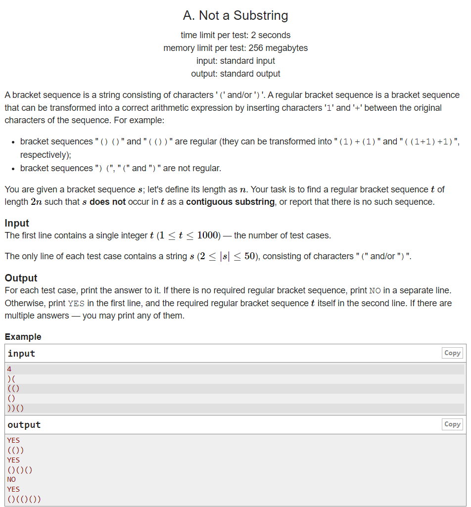
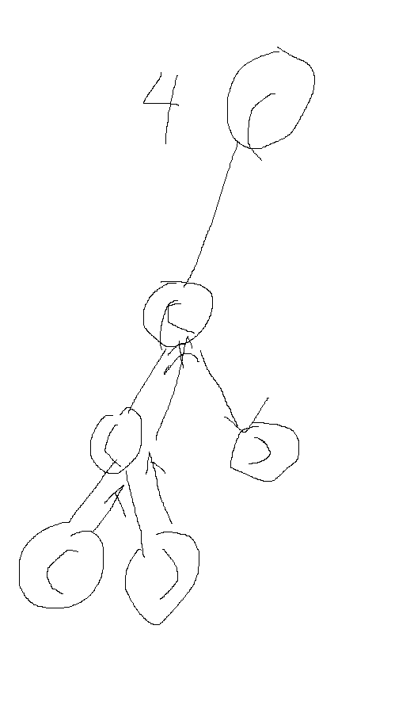
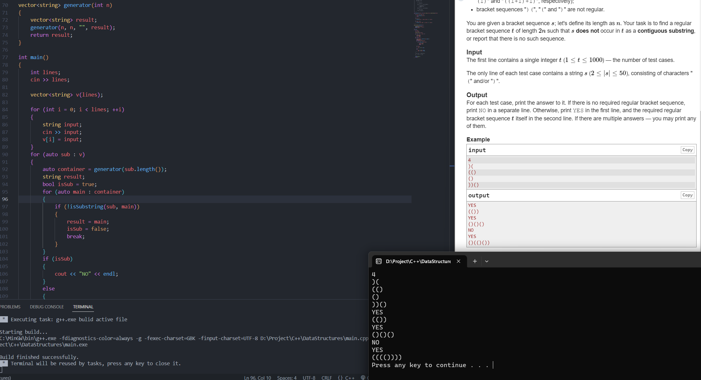
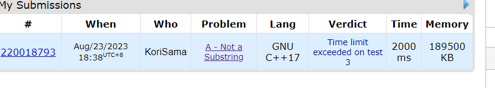

Today I was diving to a problem in CodeForce. Maybe because of my curiosity, I had a try in this problem named _Not a Substring_, which I shouldn't touch.


## Thinking Path

At the beginning, my thinking was brackets matching because I learnt how to match brackets using stack few days ago.

```C++
bool isValid(string str)
{
    stack<char> stk;
    for (auto i : str)
    {
        if (i == '(')
        {
            stk.push(i);
        }
        else if (i == ')' && !stk.empty())
        {
            if (stk.top() == ')')
                return false;
            stk.pop();
        }
        else if (i == ')' && stk.empty())
        {
            return false;
        }
        return stk.empty();
    }
}
```

How to use this function? Of course list all of possible situations of "("and")". Then using this function to check all of situations and leave the valid ones.

```C++
void generator(int left, int right, string current, vector<string> &result)
{
    if (left == 0 && right == 0)
    {
        if(!isValid(current))   //useless
            return;
        result.push_back(current);
        return;
    }

    if (left > 0)
    {
        generator(left - 1, right, current + "(", result);
    }

    if (right > left)
    {
        generator(left, right - 1, current + ")", result);
    }
}

vector<string> generator(int n)
{
    vector<string> result;
    generator(n, n, "", result);
    return result;
}
```

Classic DFS. However, after testing, I found the brackets matching was useless. Because through this DFS, generated brackets strings must be valid.

Anyway, the brackets strings had been generated. The next step is just find if the input is a substring of generated strings.

```C++
bool isSubstring(const std::string& sub, const std::string& main) {
    int i = 0;
    int j = 0;

    while (i < main.size()) {
        if (main[i] == sub[j]) {
            j++;

            if (j == sub.size()) {
                return true; // Substring found
            }
        } else {
            i = i - j + 1;
            j = 0;
        }

        i++;
    }

    return false; // Substring not found
}
```

DanDan! Success is coming soon, the last step is easy, just call above functions in main function.

```C++
int main()
{
    int lines;
    cin >> lines;

    vector<string> v(lines);

    for (int i = 0; i < lines; ++i)
    {
        string input;
        cin >> input;
        v[i] = input;
    }
    for (auto sub : v)
    {
        auto container = generator(sub.length());
        string result;
        bool isSub = true;
        for (auto main : container)
        {
            if (!isSubstring(sub, main))
            {
                result = main;
                isSub = false;
                break;
            }
        }
        if (isSub)
        {
            cout << "NO" << endl;
        }
        else
        {
            cout << "YES" << endl;
            cout << result << endl;
        }
    }

    system("pause");
    return 0;
}
```

Input the example and then... success!!!!


## Big Fail

When I submitted with laugher, the fact hit me a lot. Time out of limit!


To be honest, this is in my consideration. The time complexity of my code is O(2^n). I didn't lost my belief. I tried to improve my match algorithm to KMP pattern searching.

```C++
void getNext(vector<int> &next, string &sub)
{
    next[0] = 0;
    int x = 1;
    int now = 0;

    while (x < sub.length())
    {
        if (sub[now] == sub[x])
        {
            now += 1;
            next[x] = now;
            x += 1;
        }
        else if (now)
        {
            now = next[now - 1];
        }
        else
        {
            next[x] = 0;
            x += 1;
        }
    }
}

bool isSubstring(string &sub, string &main)
{
    vector<int> next(sub.length());
    getNext(next, sub);

    int i = 0;
    int j = 0;
    while (i < main.length())
    {
        if (main[i] == sub[j])
        {
            i++;
            j++;
            if (j == sub.length())
                return true;
        }
        else if (j)
        {
            j = next[j - 1];
        }
        else
        {
            i += 1;
        }
    }
    return false;
}

```

However, from O(N\*M) to O(N+M), do not influence the O(2^n) of DFS. Finally, I read the official answer and shocked me. So simple and perfect.

```C++
#include <bits/stdc++.h>

using namespace std;

int main() {
  ios::sync_with_stdio(false); cin.tie(0);
  int t;
  cin >> t;
  while (t--) {
	string s;
	cin >> s;
	int n = s.size();
	string a, b;
	for (int i = 0; i < 2 * n; ++i) {
	  a += "()"[i & 1];
	  b += ")("[i < n];
	}
	if (a.find(s) == string::npos) {
	  cout << "YES\n" << a << '\n';
	} else if (b.find(s) == string::npos) {
	  cout << "YES\n" << b << '\n';
	} else {
	  cout << "NO\n";
	}
  }
}
```

Maybe it's why there is a great gab between me normal person and genius.😭😭😭
